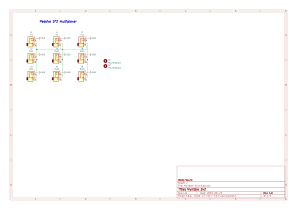
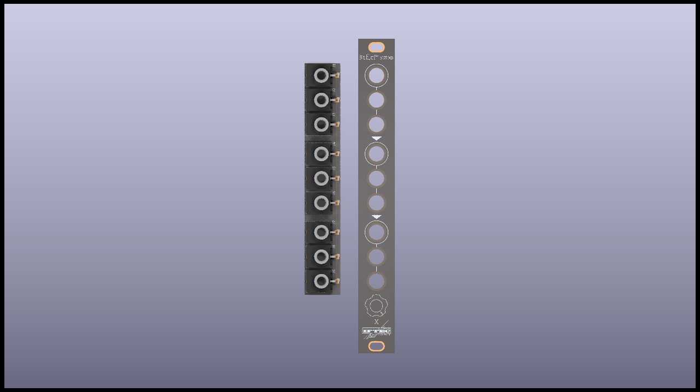
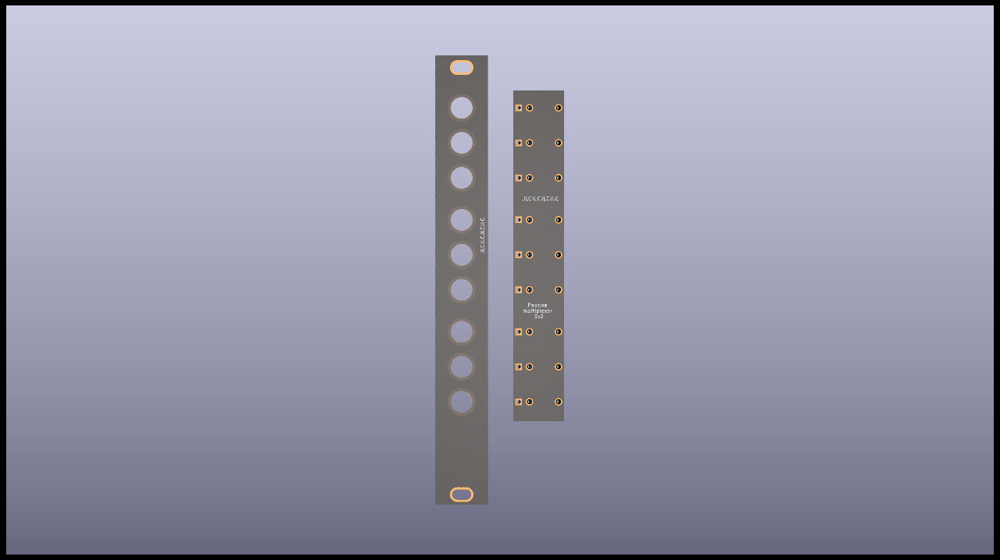
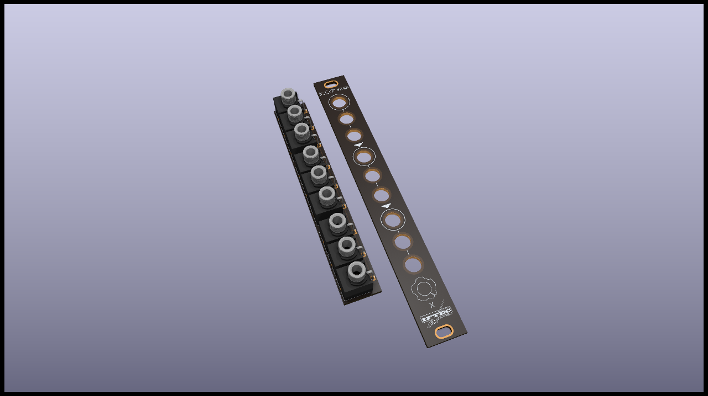

# multiple-3x2

Basic passive multiple, with a total of 3 inputs.

Each input is routed to 2 outputs.

All the sections "cascade" onto one another, so if you plug only input 1, you'll get that signal on all the 6 ouputs

You'll find the schematic of this module below: 

:warning: Fisrt place all the jack sockets, put in place the front panel, then fasten all jacks to it. Once this is done, you can solder them. 

[See bom globale](documentation/bom/Multiple-3x2_V1.0--iBoM.html)

